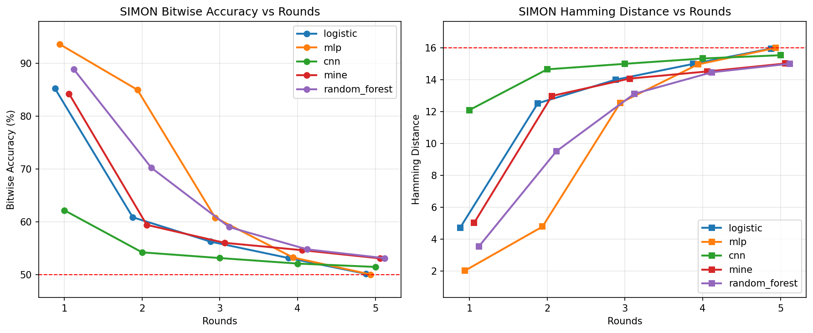

# Cipher Learning With Machine Learning

This project studies whether standard machine-learning models can learn reduced-round mappings of lightweight cryptographic ciphers and permutation-based primitives. For each supported cipher, the code generates plaintext and ciphertext bit datasets, trains several ML models, evaluates prediction quality, and saves plots plus comparison reports.

The experiments are intentionally educational and comparative. Several cipher files implement reduced-round or inspired mappings so the training pipeline can compare behavior across different cipher structures under the same workflow.

## What The Project Does

For each cipher and each round setting `r = 1, 2, 3, 4, 5`, the pipeline:

1. Generates a dataset of random plaintexts and corresponding ciphertext outputs.
2. Converts inputs and outputs into bit vectors.
3. Trains multiple ML models on the same dataset.
4. Computes common metrics such as bitwise accuracy, Hamming distance, and full-word accuracy.
5. Saves JSON metrics, summary files, plots, and cross-model comparison reports.

## Supported ML Models

### Logistic Regression

Fast baseline that trains one binary classifier per ciphertext bit. It is useful as a simple, interpretable reference model.

### MLP

A feed-forward neural network trained as a multi-output classifier. It provides a stronger nonlinear baseline than logistic regression.

### CNN

A lightweight 1D convolutional neural network that treats plaintext bits as a compact signal and predicts all output bits jointly.

### MINE-Inspired Model

A neural predictor with an auxiliary mutual-information-style objective. It is used as an additional comparative deep-learning model in the project.

### Random Forest

An ensemble tree-based baseline that predicts all ciphertext bits jointly. It provides a useful non-neural comparison point when linear models are too weak but lightweight training is still preferred.

## Supported Ciphers

### SIMON

Lightweight Feistel-style block cipher based on rotation, AND, and XOR operations. It is a common reference cipher in lightweight cryptography and cryptanalysis research.

### ASCON

Permutation-based lightweight cryptographic design selected by NIST for lightweight cryptography. In this project, an ASCON-inspired reduced-round mapping is used for comparison.

### GIMLI

Lightweight permutation primitive built around a structured internal state update. Here it is used as a reduced-round research-oriented mapping.

### TinyJAMBU

Lightweight AEAD design centered on a compact nonlinear state update. This project uses a simplified reduced-round TinyJAMBU-inspired mapping.

### KATAN

Hardware-oriented lightweight block-cipher family based on small shift registers and Boolean update rules. The code uses a KATAN-32-style reduced-round mapping.

### Grain-128a

Lightweight stream-cipher and AEAD-related design built from LFSR and NFSR components. The project uses a simplified keystream-style mapping for dataset generation.

### LED

Lightweight 64-bit block cipher with nibble-oriented substitution and permutation structure. The implementation here is an LED-inspired reduced-round SPN mapping.

### SKINNY

Lightweight tweakable block-cipher family widely used in modern lightweight-crypto benchmarks. This repository includes a compact SKINNY-inspired reduced-round mapping.

### PRESENT

Ultra-lightweight block cipher introduced for constrained devices such as RFID and sensor nodes. It is one of the standard lightweight block-cipher references.

### PRINCE

Low-latency lightweight block-cipher design focused on efficient hardware-style evaluation. The project uses a compact PRINCE-inspired reduced-round mapping.

### SPECK

Lightweight ARX cipher family using addition, rotation, and XOR. It serves as a software-oriented counterpart to SIMON in lightweight crypto studies.

### XOODOO

Lightweight permutation core used in Xoodyak-family constructions. This project uses a reduced-round Xoodoo-inspired mapping for comparison.

### Trivium

Lightweight stream-cipher design built around nonlinear shift-register updates. The repository uses a compact Trivium-inspired reduced-round mapping.

### ChaCha20

ARX-based stream cipher built from quarter-round operations over a 512-bit state. This project uses a reduced-round ChaCha-style mapping and exports a 64-bit output slice for learning experiments.

### MICKEY

Hardware-oriented stream cipher based on two irregularly clocked registers with nonlinear control. The repository includes a simplified MICKEY-inspired reduced-round mapping.

### Salsa20

Stream cipher related to ChaCha and based on ARX quarter-round transformations. The project uses a reduced-round Salsa-style mapping for comparative experiments.

### RECTANGLE

Ultra-lightweight block cipher with a compact substitution-permutation structure. The repository includes a reduced-round RECTANGLE-inspired mapping.

### GIFT

Lightweight bit-permutation based block cipher designed for high efficiency in both hardware and software. It is a successor to PRESENT with improved security and performance.

### AES

Standard block cipher with 128-bit blocks and byte-oriented substitution, permutation, and mixing layers. This project includes a reduced-round AES-128 mapping for comparison against the lightweight designs.

### LEA

Lightweight ARX block cipher with 128-bit block size designed for fast software implementation. This repository includes a reduced-round LEA-inspired mapping for comparative learning experiments.

## Performance Observations

Based on the experimental results for reduced-round configurations (r=1 to r=5), here are the key observations regarding model learnability and cipher resistance:

### Top 5 Most Learnable Ciphers (Highest Accuracy)

These ciphers show the highest bitwise accuracy in early rounds (r=1), indicating that their initial transformations are more easily approximated by neural and linear models:

1.  **TinyJAMBU**: Consistently shows the highest accuracy (~96.9% in round 1), often maintaining better-than-random accuracy across more rounds.
2.  **SIMON**: Highly learnable in round 1 (~96.7%), likely due to its simple ARX structure.
3.  **Trivium**: Shows very high accuracy (~96.2%), reflecting its relatively simple shift-register based linear update.
4.  **XOODOO**: Another top performer with high initial accuracy (~95.5%).
5.  **PRESENT / KATAN**: Both show strong learnability in initial rounds (~94%), characteristic of their lightweight substitution-permutation or shift-register designs.

### Ciphers with Better Hamming Distance (Lowest Error)

The Hamming Distance (HD) represents the average number of bit errors in the prediction. Lower is better.

*   **32-bit ciphers (SIMON, SPECK, KATAN)**: Naturally have lower absolute Hamming Distance values due to their smaller block size. For example, **SIMON** and **SPECK** often show HD < 2 in round 1.
*   **Trivium / TinyJAMBU**: Despite having 64-bit outputs, these ciphers maintain relatively low HD in early rounds compared to other 64-bit designs.

### Ciphers "Not Good" for ML (Most Resistant)

These ciphers are significantly harder for models to learn, reaching near-random accuracy (50%) much faster as rounds increase:

*   **AES**: The heavy byte-oriented S-box and mixing layers make AES one of the most resistant ciphers in this study. Accuracy drops sharply after round 1.
*   **LED & PRINCE**: These designs show lower initial accuracy (~72% in round 1) compared to others, indicating a more complex initial diffusion layer.
*   **Grain-128a**: While learnable in very low rounds, its accuracy degrades quickly as the round count increases compared to other stream-cipher-inspired mappings.

### General Insights
*   **Round Sensitivity**: All ciphers show a significant drop in accuracy as the round count `r` increases. By round 5, most ciphers approach 50% bitwise accuracy (random guessing).
*   **Architecture vs. Learnability**: ARX-based ciphers (SIMON, SPECK) and simple bit-permutation ciphers (PRESENT, GIFT) are generally more susceptible to ML-based approximation in low rounds than byte-oriented SPN ciphers (AES).
*   **Model Comparison**: Neural models (MLP, CNN) consistently outperform Logistic Regression, especially for ciphers with nonlinear components, though the gap narrows as the cipher complexity increases with more rounds.

## Latest Results & Visualizations

The experiment results and comparison plots have been recently updated to provide clearer insights into model performance across all ciphers.

### Sample Model Comparison (SIMON)
The following plot shows how different ML models perform as the number of rounds increases for the SIMON cipher:



*Comparison plots like the one above are available for all ciphers under `results/comparison/<cipher>/`.*

### Key Plot Features:
- **Bitwise Accuracy vs. Rounds**: Shows how quickly each model's prediction quality degrades as the cipher complexity increases.
- **Hamming Distance Trends**: Visualizes the average bit-error rate across different round counts.
- **Model Efficiency**: Helps identify which architectures (CNN, MLP, etc.) are best suited for specific cipher structures.

## Project Structure

```text
Ac/
├── ciphers/                 # Cipher and permutation implementations
├── data/                    # Generated datasets and per-cipher metadata
├── experiments/             # Per-cipher experiment runners (main_<cipher>.py)
├── models/                  # ML model training code and shared utilities
├── results/                 # Plots, reports, and comparison artifacts
├── run_all.py               # Runs all cipher pipelines sequentially
├── requirements.txt         # Python dependencies
└── Project 2.pdf            # Project/report document
```

### Key Folders

`ciphers/`

Contains the encryption or permutation-style mappings used to generate ciphertext labels from plaintext samples.

`data/`

Stores generated datasets under cipher-specific directories such as `data/simon/`, `data/ascon/`, and `data/skinny/`.

`models/`

Contains five ML model implementations and shared utilities for dataset loading, splitting, metrics, and summary saving.

`results/`

Stores per-model metrics, generated plots, and cross-model comparison reports for each cipher.

## Installation

### 1. Create and activate a virtual environment

On Windows PowerShell:

```powershell
python -m venv .venv
.venv\Scripts\Activate.ps1
```

### 2. Install dependencies

```powershell
pip install -r requirements.txt
```

### Required packages

The project currently depends on:

- `numpy`
- `scikit-learn`
- `matplotlib`
- `torch`

## How To Run

### Run one cipher

Each cipher has its own runner under `experiments/`.

Examples:

```powershell
python experiments/main_simon.py
python experiments/main_ascon.py
python experiments/main_tinyjambu.py
python experiments/main_skinny.py
```

Each runner will:

1. Generate datasets for rounds `1, 2, 3, 4, 5`.
2. Train Logistic Regression, MLP, CNN, MINE, and Random Forest.
3. Save summaries and plots.
4. Build a per-cipher comparison report.

### Run all ciphers

```powershell
python run_all.py
```

This sequentially runs:

- `experiments/main_simon.py`
- `experiments/main_ascon.py`
- `experiments/main_gimli.py`
- `experiments/main_tinyjambu.py`
- `experiments/main_katan.py`
- `experiments/main_grain128a.py`
- `experiments/main_led.py`
- `experiments/main_skinny.py`
- `experiments/main_present.py`
- `experiments/main_prince.py`
- `experiments/main_speck.py`
- `experiments/main_xoodoo.py`
- `experiments/main_trivium.py`
- `experiments/main_chacha20.py`
- `experiments/main_mickey.py`
- `experiments/main_salsa20.py`
- `experiments/main_rectangle.py`
- `experiments/main_aes.py`
- `experiments/main_gift.py`
- `experiments/main_lea.py`

### Fast smoke-test mode

If you want a shorter run with smaller datasets and lighter model settings:

```powershell
python run_all.py --fast
```

Fast mode reduces sample counts and training cost so the full pipeline is easier to test quickly.

## Generated Outputs

### Datasets

For each cipher and round, dataset files are written to:

```text
data/<cipher>/X_r<round>.npy
data/<cipher>/y_r<round>.npy
data/<cipher>/metadata_r<round>.json
```

### Metrics

Per-round metrics and per-model summaries are written to:

```text
results/metrics/<cipher>_<model>_r<round>.json
results/metrics/<cipher>_<model>_summary.json
```

### Plots

Model-wise plots are written to:

```text
results/plots/<cipher>_<model>_results.png
```

### Cross-model comparison reports

Comparison outputs are written to:

```text
results/comparison/<cipher>/all_models_comparison.png
results/comparison/<cipher>/all_models_summary.json
results/comparison/<cipher>/comparison_table.md
results/comparison/<cipher>/round_<round>_comparison.json
```

## Evaluation Metrics

The project compares models using three shared metrics:

- `bitwise_accuracy`: fraction of correctly predicted output bits.
- `hamming_distance`: average number of differing bits between true and predicted outputs.
- `word_accuracy`: fraction of samples where the full predicted output word matches exactly.

## Notes And Scope

- The repository is designed for reduced-round learning experiments, not for production cryptography.
- Some cipher modules are educational or inspired mappings rather than full standard-compliant implementations.
- Full runs can take time, especially for neural models and larger 64-bit ciphers.
- The `--fast` mode is the recommended way to verify the whole pipeline quickly.

## Useful Entry Points

- `run_all.py`: run the full multi-cipher experiment suite.
- `experiments/main_<cipher>.py`: run one cipher end to end.
- `data/generate_dataset.py`: generate or load datasets.
- `models/`: train and evaluate ML models.
- `results/generate_all_plots.py`: generate saved plots from summaries.
- `results/comparison_report.py`: build cross-model comparison reports.

## Expected Workflow

If you are exploring the repository for the first time, a practical order is:

1. Install dependencies.
2. Run one cipher such as `python main_simon.py`.
3. Inspect `data/`, `results/metrics/`, and `results/plots/`.
4. Run `python run_all.py --fast` for a quick full-project validation.
5. Run `python run_all.py` for the complete experiment set.